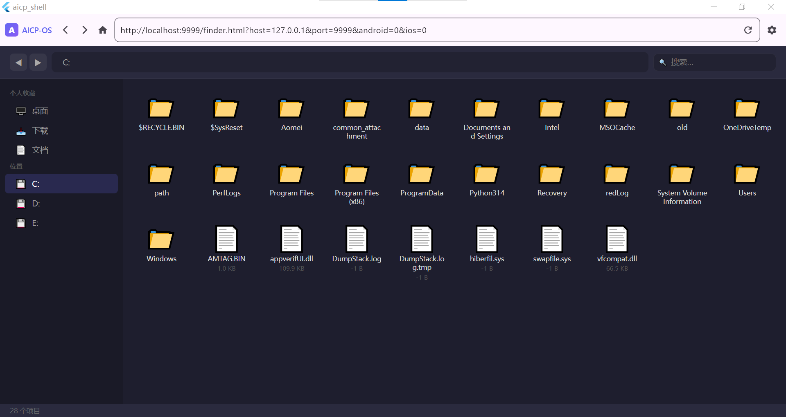
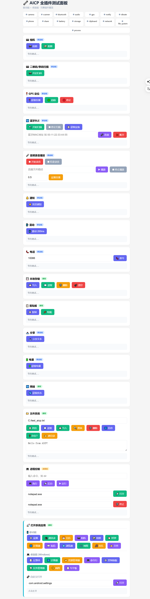

# AICP Shell
[中文](README_CN.md) | [English](README.md) 
## 让 HTML 成为操作系统的跨平台容器
> **Make HTML Your Operating System** — A cross-platform runtime container that empowers plain HTML/JS with full native hardware access, 7 supported platforms, 30+ hardware APIs, built-in AI-native architecture.

---
## 自带HTML DEMO

### *HTML-Finder — 在 AICP Shell 里像 macOS 一样浏览本地文件，新建、修改、删除、运行*


### *功能测试面板 — 只用 HTML + JS 调用所有平台硬件，挂载在任何地方*


## 项目核心定位
打破网页与原生系统的壁垒，让 HTML 不再局限于浏览器展示页面，而是拥有完整操控设备底层的能力。

| 使用场景 | 传统方案 | AICP Shell |
|---------|---------|-----------|
| 调用设备硬件 | 单独开发原生 SDK、编写平台专属代码、多端重复编译 | `window.mobile.camera.take()` 一行 JS 调用 |
| 对接 AI 后端服务 | 独立部署 Python 环境、配置依赖、处理跨进程通信 | 标准 fetch 网络请求即可互通 |
| 多终端适配开发 | Android/iOS/Windows/Linux/鸿蒙五套独立工程，多团队维护 | 单套 HTML 代码，一次性适配 7 大平台 |
| 本地系统深度控制 | WSL/Docker 环境部署、编写大量运维脚本 | JS 调用系统进程 API，极简指令完成操作 |

仅使用 HTML/JS，无需额外编译框架，直接操控设备全部底层能力。

---
## 主流开发方案横向对比

| 对比维度 | 原生开发 (Kotlin/Swift/C#) | 普通 Web 网页 | Python/CLI 工具 | Electron | AICP Shell |
|---------|---------------------------|--------------|----------------|----------|------------|
| 开发语言 | 多语言分端开发 | HTML/CSS/JS | Python/NodeJS | HTML/CSS/JS | 统一 HTML/JS |
| 跨平台能力 | 各端完全重写 | 仅浏览器可用 | 桌面端受限 | 仅桌面端 | 7 大平台全覆盖 |
| 原生硬件调用 | 完整支持 | 浏览器严格权限限制 | 无法调用移动端硬件 | 仅少量桌面硬件 | 30+ 全平台硬件 API |
| 系统命令/进程控制 | 支持 | 完全禁止 | 支持桌面 | 有限支持 | 全平台开放调用 |
| 远程网页动态加载 | 不支持 | 原生能力 | 不支持 | 支持 | 原生支持远程页面 |
| 在线热更新 | 应用商店审核，周期长 | 页面刷新即更新 | 无法热更 | 整包更新 | 页面秒级无审核更新 |
| AI 自动生成适配 | 代码复杂 AI 适配差 | 完美适配 AI 生成前端 | 仅后端逻辑 | 可生成页面 | 天生适配 AI 全链路生成 |

**AICP Shell = 原生底层硬件权限 + Web 轻量化灵活迭代 + AI 全链路适配**，三位一体。

---
## 底层架构说明
本项目完全基于自研 [AICP 协议](https://github.com/woozheng/aicp)，由 AI 辅助完成整套架构设计、插件编写、Web 通信桥设计。

单一 Flutter 工程，一套代码编译运行全平台。

## 已完整支持平台（CI 流水线全部构建成功）

> 推送 main 分支自动打包，产物保留90天，下方链接直达最新构建包，无需登录 GitHub 直接下载

| 平台 | 适配状态 | 补充说明 | 一键下载 |
|-----|---------|---------|------|
| Android | ✅ 编译通过 | 蓝牙、音频、扫码、定位、通知全部插件适配 | [⬇️ Android APK](https://nightly.link/woozheng/aicp_shell/workflows/build-all.yml/main/Android-Release-APK.zip) |
| Windows | ✅ 编译通过 | 文件系统、进程命令、窗口管理完整适配 | [⬇️ Windows 安装包](https://nightly.link/woozheng/aicp_shell/workflows/build-all.yml/main/Windows-x64-Bundle.zip) |
| Linux x64 | ✅ 编译通过 | 桌面文件管理器、WebView 运行时完整可用 | [⬇️ Linux 压缩包](https://nightly.link/woozheng/aicp_shell/workflows/build-all.yml/main/Linux-x64-Bundle.zip) |
| macOS | ✅ 编译通过 | Mac 桌面运行时、WebView 底层适配完成 | [⬇️ macOS App](https://nightly.link/woozheng/aicp_shell/workflows/build-all.yml/main/macOS-App.zip) |
| HarmonyOS 鸿蒙 | ⏳ 本地手动编译 | 权限分层适配，全硬件 API 兼容 | [📖 编译说明](./docs/ohos_config.md) |
| iOS | ⏳ 本地手动编译 | 底层通信协议已全部适配 | 按需编译 |
| Web | ⏳ 本地手动编译 | AICP 通信桥逻辑完成 | 按需编译 |

---
## 🚀 准备好在 AICP Shell 里用 HTML 开发什么应用了么？
- 🤖 **直接操作你电脑的本地 AI 助手** — AI 生成 JS 脚本并一键执行，自由操控手机、电脑所有硬件
- 🧠 **集成 Claude Code / Codex / Hermes 的超级 AI 终端** — 跨设备全盘控制本地资源与系统进程
- 🖥️ **轻量化跨平台云桌面系统** — 类似 ChromeOS，HTML 页面深度打通本地文件读写
- 🏢 **企业级免审核秒更客户端** — 数据本地存储，一套页面全平台分发，更新无商店审核
- ☁️ **打通本地与云端的统一 AI 应用** — 抹平前后端、本地/云端壁垒，只用 HTML 实现完整业务
- 🧩 **一站式 AI 工具聚合桌面** — 本地文件无需上传，秒级热更新，开箱即用各类AI能力

**来吧，开发你的想象力。**

## 快速启动
```bash
# 拉取本Shell容器仓库
git clone https://github.com/woozheng/aicp_shell.git
cd aicp_shell

# 拉取依赖
flutter pub get

# 直接运行当前平台
flutter run
```

## AICP_shell SDK
### AI 友好硬件调用 SDK
仅参考内置演示文件 [god_mode.html](./assets/god_mode.html)，AI 阅读后即可掌握全部硬件调用规范。

### 扩展 AICP Shell 底层原生功能
1. 新建硬件插件，放置至 `lib/plugins/` 目录
2. 在 `lib/core/register.dart` 完成插件导入、注册、权限声明，参照现有插件模板即可，AI 可一键生成代码
3. JS 调用示例查看 `god_mode.html`，AI 可自动生成前端交互逻辑

## License
MIT — 随便用，随便改，随便炸。🚀

完整协议文本查看 [LICENSE](LICENSE)